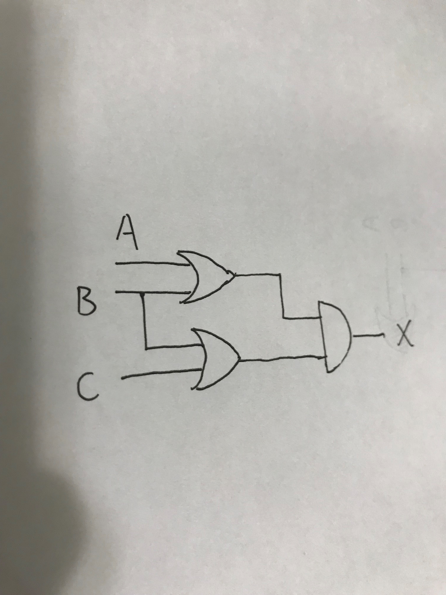
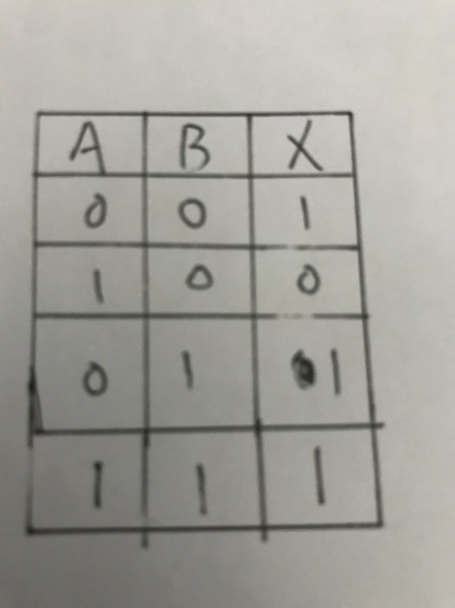
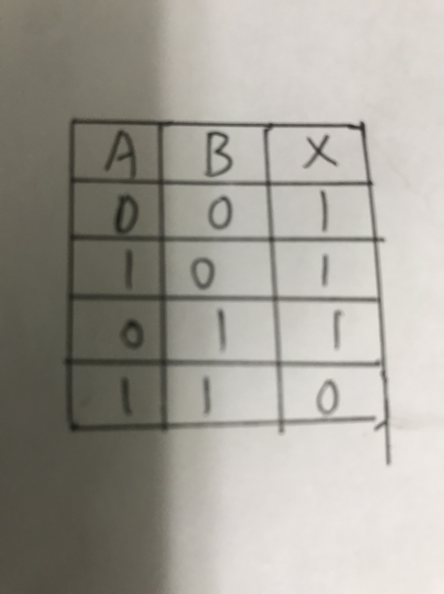
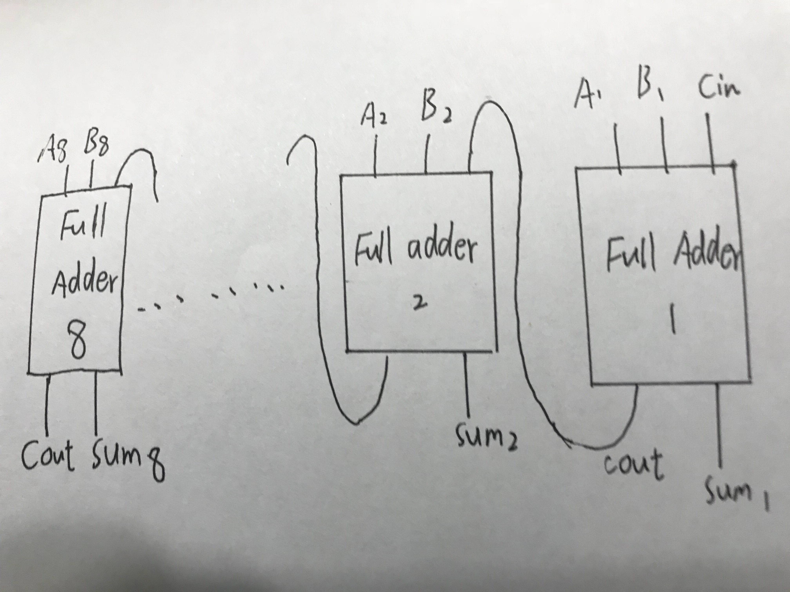

## 1) Give the three representations of an AND gate and say in yourwords what AND means.  
三个特点：布尔表达式：X=A·B

逻辑框图：
    

真值表：

MY WORD:当且仅当两个输入值都为真时与门输出为真，否则为假。

## 2) Give the three representations of an XOR gate and say in yourwords what XOR means.

布尔表达式：X=A ⊕ B

逻辑框图：

真值表：

MY WORD:异或门当且仅当两个输入值不相等时输出真，否则输出假。

## 3) Draw a circuit diagram corresponding to the following Booleanexpression: (A + B)(B + C)

## 4)Show the behavior of the following circuit with a truth table:

## 5)What is circuit equivalence? Use truth table to prove the following formula.

(AB)’ = A’ + B’

电路等价（circuit equivalence)表示当两个电路有相同输入时有相同输出(即真值表相同）的情况。

无论是(AB)’还是 A’ + B’的真值表都是：

## 6)There are eight 1bit full adder integrated circuits. Combine them to 8bit addercircuit using the following box diagram

## 7)Logical binary operations can be used to modify bit pattern. Such as(X8X7X6X5X4X3X2X1)2 and (00001111)2 = (0000X4X3X2X1)2We called that (00001111)2is a mask which only makes low 4 bits to work.Fill the follow expression.

(1) (X8X7X6X5X4X3X2X1)2 or (00001111)2 = (X8X7X6X5X4X3X2X1)2

(2) (X8X7X6X5X4X3X2X1)2xor (00001111)2 = (X8X7X6X5X40000)2

(3) ((X8X7X6X5X4X3X2X1)2 and (11110000)2 )or (no(X8X7X6X5X4X3X2X1)2and (00001111)2) = (X8X7X6X5X40000)2

# 词语解释

## 1)Logic gate

a logic gate is an idealized or physical device implementing a Boolean function; that is, it performs a logical operation on one or more binary inputs and produces a single binary output. 

## 2)Boolean algebra

Boolean algebra is the branch of algebra in which the values of the variables are the truth values true and false, usually denoted 1 and 0 respectively.

## 3)

Flip-flop 中文翻译是触发器或锁存器

2)How many bits information does a SR latch store?

1bit。

 

