# 制作移动射击类html5小游戏的教程

## 第一步 构建思路与获取素材
我们这次希望做一个常见的宇宙飞船射击游戏。我们先要想好角色的种类（主角，敌人1，敌人2，boss）以及子弹的种类（两种）。

有了思路后我们就去网上找背景以及飞船和子弹的素材吧。

结果如下
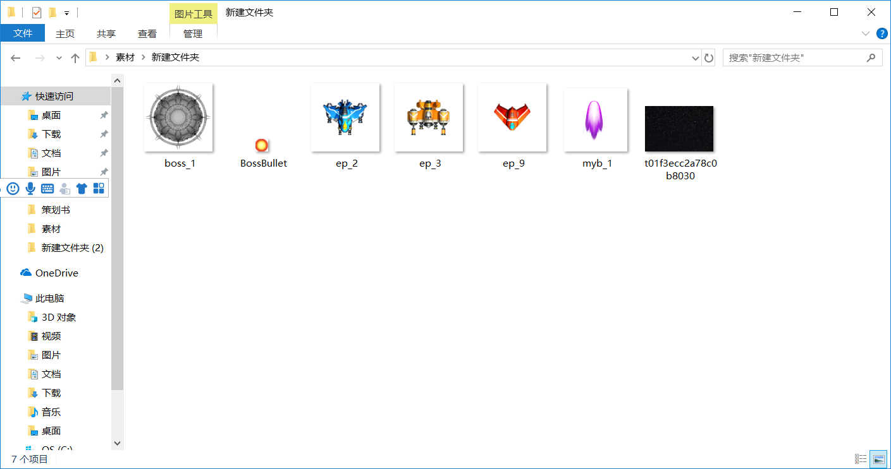

## 第二步 制作背景与sprite
接下来我们打开construct2，点击file新建一个文件并选择最上面的空白模板。

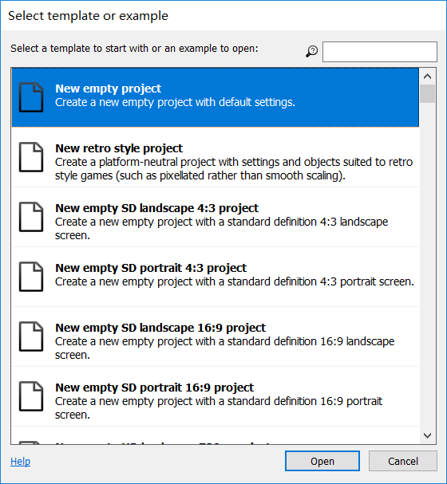

之后双击空白部分进入插入新对象的选项，分两次分别选择mouse和keybored 类型，让我们可以通过鼠标和键盘操作。

之后双击并选择tiled background

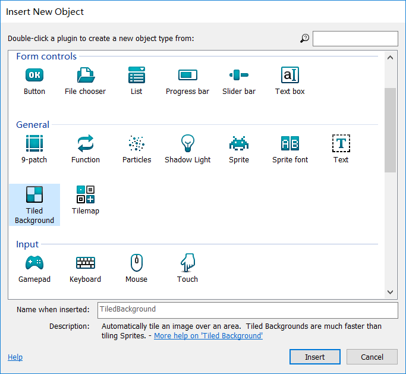

此时出现一个十字指针，点布局中间的某个位置,之后出现插入图片的界面，选择一开始准备好的背景
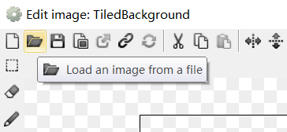

按右上角的X之后在左栏调整背景的参数，postion设置为0,0,；size设为你这个图层的大小
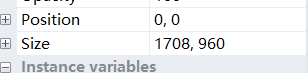
在右边新建两个图层，将背景图层前面的锁点上.
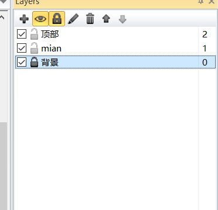
之后选择main图层，双击main图层，选择Sprite类型，一个个将素材插入。

将一开始我们不希望它们出现的对象放在背景外面。

之后我们给它们赋予行为。点击一个对象，在左边的behaviors中点击添加。
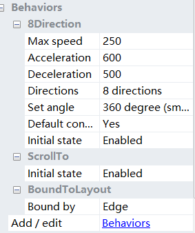
以player为例给它加上

1、8direction

2、scroll to

3、bound to layout.

这三个行为的意思是1、可以用方向键操作

2.画面跟随

3.不会超出边界。

接下来

 将Bullet和Destroy outside layout添加到Bullet对象
- 将bullet添加到Monster对象（因为它也向前移动）
- 将Fade行为添加到Explosion对象（因为它逐渐消失）

之后调整玩家速度为250，玩家子弹为600，怪物子弹为350，爆炸fade时间为0.5s等。

## 第三步 加入"活动“
点击上方的event sheet切换
 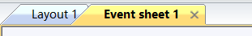

之后我们希望做到：

1、飞机头始终对着鼠标

我们点击add event
选择system everytick
然后add actiong>player>set angle toward <mouse.X,mouse.Y>
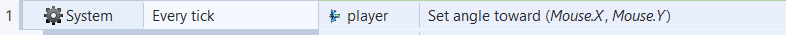
2.怪物1每两秒出现一个，一开始方向随机，碰壁后飞向玩家。
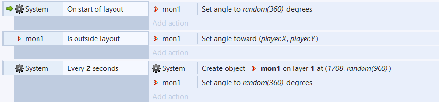
1708是背景最右端，random（960）是让它们出生在任意高度。

3.怪物2追着玩家并每2秒射一发子弹，每5S出现一个怪物2.
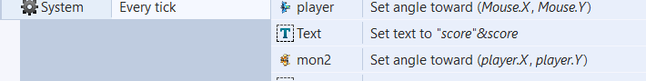
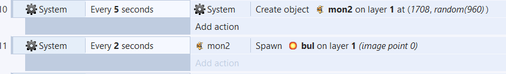
之后我们要考虑攻击的互动，首先我们设置一下玩家与怪物的血量。

其中怪物的血量可以设置为一个“实例变量”，会每个怪物（实例）都有自己的血量。在左栏的instance varibles中添加

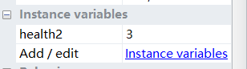

其中mon1有2滴血，mon2有3滴血，boss有50滴血。

然后是玩家的血量，这时我们要提到一个概念“全局变量”，因为我们希望将玩家血量显示在左上方，所以需要一个在任何时候都可以调用的量，那就是全局变量，在活动区的空白处单击右键建立。
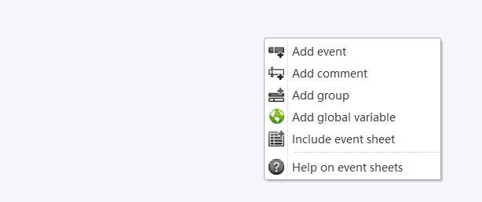
之后我们顺便将我们的分数也定义为一个全局变量。

然后我们开始互动

首先定义一下击中时的活动：目标掉血，子弹爆炸，子弹消失。
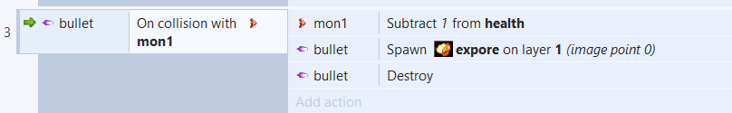
我们只要换一下子弹和目标的类型，就可以定义所有的击中效果。如（玩家击中mon1，mon2，boss）或（mon1，mon2，与玩家相撞，敌人子弹击中玩家。）

再定义一下怪物和玩家的被消灭：当health<=0时，引发爆炸并消失。
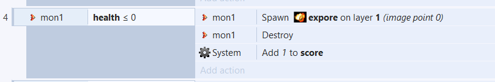

## 第四步 表示数据并终结游戏
我们希望把分数与玩家血量两个量始终表现在屏幕左上。
我们用到第三个图层，将其parallax参数改为（0,0），这个图层就会保持在左上。

之后在这个图层左上插入两个text文本框
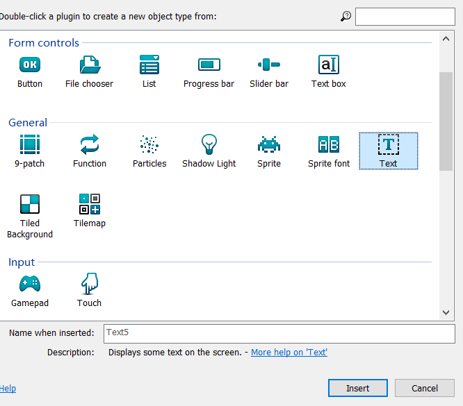

之后再活动框中选择 system>everytick

 action:text>set text to"score"&score 前一个score是指文本框中始终写着一个score，后一个&score是在框中引用全局变量score。对于玩家血量也是一样设置。
 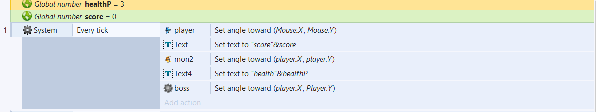
 之后在文本框的属性中调整字号和颜色让它们合适。
 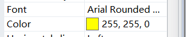上面是字号和字体，下面是颜色。

 效果如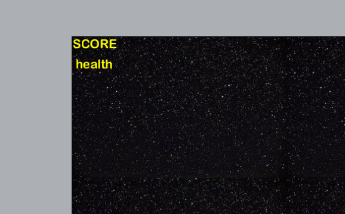

 之后准备结束游戏，游戏目标是打败boss或者玩家死亡。
 我们希望击败足够小兵后boss才出现，所以我们令它分数大于50时才出现
 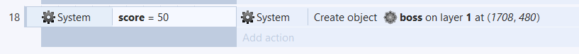

 当boss被击败或是玩家死亡后在地图中间出现标语当做游戏结束的标志

 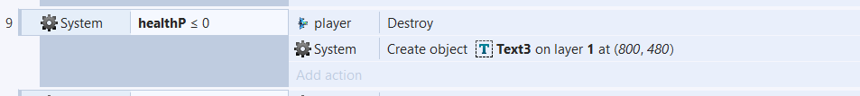
 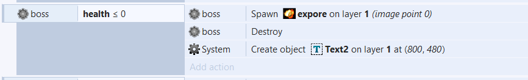
效果如下：
 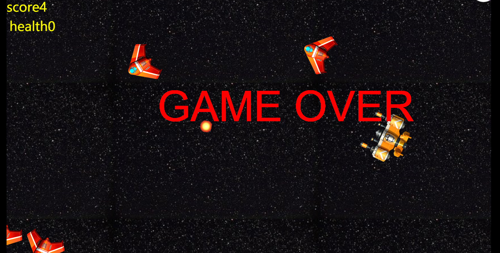

 <iframe height=500 width=500 src="images/123.gif"