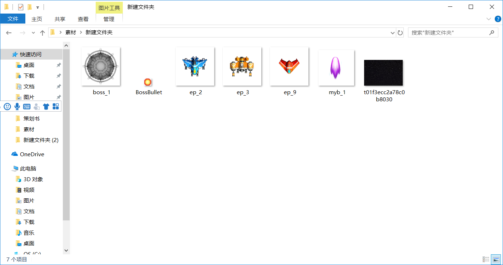
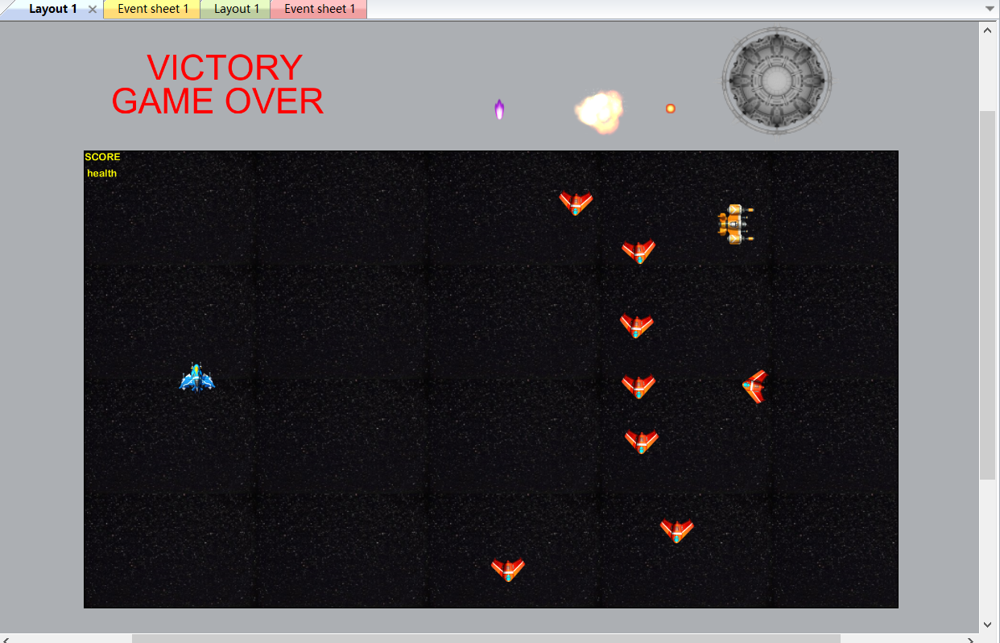
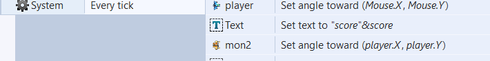
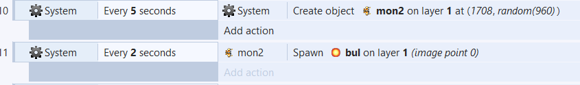

# HTML5游戏设计与制作(进阶篇)

## 1）游戏的策划
```
楔子(Setting)：公元3333年，你驾驶人类最先进的探索飞船在外太阳系收集资料，发现了一支身份不明的舰队，由于地球上没有能比你的飞船飞的更远的飞船，你判断这支舰队是外星舰队。正当你向地球通信时你被对方发现，对方立即开始对你攻击。为了让对方不发现地球，你必须在孤立无援的情况下消灭这只舰队。幸运的是你还有用于切割陨石收集信息的高功率激光，而对方并不全是战斗编队，你决定殊死一搏，消灭对方旗舰。

玩法(Gameplay)：玩家用方向键操纵飞机点击鼠标运用激光消灭敌人，当消灭外围舰队的敌人50艘时，就可以撕开敌方的阵型，直扑对方的旗舰，消灭敌方旗舰即可获胜。若玩家的血量降为零（被攻击三次以上）则飞机被毁玩家失败。

人设与道具（Game Sprites）：
1、玩家，蓝色战机，可以发射紫色光束攻击敌人，速度为250，有三次耐久。
2、侦查机，敌人的橙色侦查小飞机，没有射击武器，为了保护旗舰不顾一切向玩家战机撞过来，只有1点耐久。初始有八个，每二秒在游戏中出现一个。
3、战斗机，敌人的黄色战斗护卫机，会向玩家发射炮弹，有三点耐久。初始有一个，每3S在游戏中出现一个，每2S发射一次子弹。
4、BOSS旗舰，玩家的目标，消灭50架敌机后出现，每0.2S发射一发炮弹，有50点耐久。消灭旗舰后游戏结束。
5、炮弹，玩家炮弹速度为600，敌人炮弹速度为350.
```
草图




## 2）游戏设计
## 1、玩家的飞机的CRC卡片
```
+---------------------------------+  
|object name： player             |  
+---------------------------------+
| Attributes：出生于地图中间（图1） |
|，蓝色飞机（图2）                  |
+--------------+------------------+
| Collaborator | Events & Actions |
+--------------+------------------+
|精灵           |8directions,始终指|
|              |向鼠标，单击发射炮弹|
|              |health为3，失去后销|
|              |毁自己。（图3）    |
+--------------+------------------+
```


(图1)


（图2）

当全局变量healthP降为0时player摧毁并在界面打出“GAME OVER”


## 2、侦察机的CRC卡片
```
+---------------------------------+  
| Object Name：mon1               |  
+---------------------------------+
| Attributes：在地图最右端的位置随机|
|出现（图1），样子见图2。           |
+--------------+------------------+
| Collaborator | Events & Actions |
+--------------+------------------+
|精灵          | bullet类型，每次到|
|              |达地图边缘时朝向玩家|
|              |1点耐久，撞到玩家造|
|              |成伤害并摧毁自己   |
+--------------+------------------+
```


图1


图2

## 3、战斗机的CRC卡片
```
+---------------------------------+  
| Object Name：mon2               |  
+---------------------------------+
| Attributes:在地图右端随机出现，样 |
|子见图1。                         |
+--------------+------------------+
| Collaborator | Events & Actions |
+--------------+------------------+
|精灵           |bullet类型，移动慢，| 
|              |始终朝向玩家，每2S发|
|              |射一发子弹，5S生成一|
|              |个，三点耐久（图2） |
+--------------+------------------+
```


图1





图2

## 4、BOSS的CRC卡片
```
+---------------------------------+  
| Object Name：boss               |  
+---------------------------------+
| Attributes：消灭50敌人出现       |
|样子见图一。                        |
+--------------+------------------+
| Collaborator | Events & Actions |
+--------------+------------------+
|精灵           |每0.2S发射一发炮弹，|
|              |50点耐久，消灭后游戏|
|              |结束。（图2）      |
+--------------+------------------+
```


图一


图二

## 5、玩家炮弹的CRC卡片
```
+---------------------------------+  
| Object Name：bullet             |  
+---------------------------------+
| Attributes：从玩家射出，样子见图一|                      
+--------------+------------------+
| Collaborator | Events & Actions |
+--------------+------------------+
|精灵          |速度600，bullet类型|
|              |击中敌人减少耐久，产|
|              |生爆炸,销毁自己（图 |
|              |二）               |
+--------------+------------------+
```


图一


## 敌人子弹的CRC卡片
```
+---------------------------------+  
| Object Name：monbullet          |  
+---------------------------------+
| Attributes：从敌人射出，样子见图一|                      
+--------------+------------------+
| Collaborator | Events & Actions |
+--------------+------------------+
|精灵          | 速度350，bullet类型|
|              |击中玩家减少耐久，产|
|              |生爆炸，销毁自己。  |                 
+--------------+------------------+
```


图一

## 爆炸的CRC卡片
```
+---------------------------------+  
| Object Name:expore              |  
+---------------------------------+
| Attributes:样子见图一            |
+--------------+------------------+
| Collaborator | Events & Actions |
+--------------+------------------+
|精灵          |FADE类型，产生于子弹|
|              |击中或飞机被毁，0.5s|
|              |后fade，行为在前几张|
|              |图见过，不放了。    |
+--------------+------------------+
```


图一

# 实际演示
