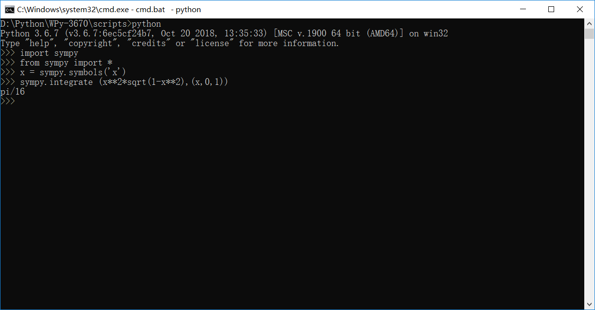

# 用 python 做计算器，做数学题
## 用python做高数作业
## 题目1 求 xsin（x）的不定积分


## 题目2 求 x^2*sprt(1-x^2)在0到1上的积分



## 用python做线代作业
## 题目1 find  the vector x determined by the given coordinate vector [x]B and the given basis B.
```
B={[4  5],[6  7]} 

[x]B=[8  -5] 
```


## 题目2 find the coordinate vector [x]B of x relative to the given basis B={b1,...,bn}.
```
b1 = [1,-2]  
b2 = [5,-6]
x = [4,0]
```
