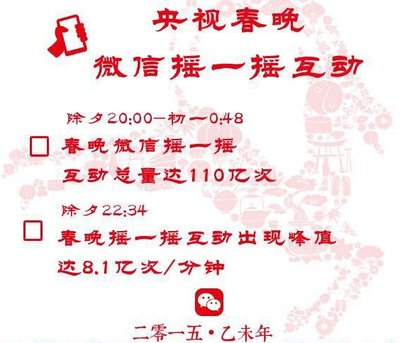
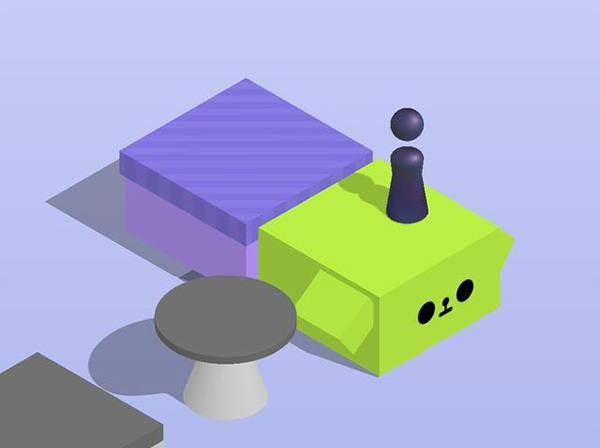

# 互联网时代的热点领域选择、营销方法

## 热点1——基于互联网的知识付费
```
我们可以看到很多视频网站自己拍摄的网剧，电影等知识产权内容、需要付费观看的电影、以及我们可以看到很多付费的网络小说和诸如知乎live、喜马拉雅付费课程、微信讲座、以及很多网课网站很多需要付费观看的课程。以及数不胜数的文档网课网站，比如ARPU，Keso。这些虚拟的内容也正是依托互联网平台才得到如此多的传播、出售并盈利的机会，这也是和互联网经济的重要热点。
   如今，互联网经济下的知识信息有以下特点：
   1.信息真伪难辨。在浩如烟海的信息网络，我们就一个关键字或者话题，能搜索出很多信息，但是我们通常很难辨别真伪。现如今我们总能看到很多辟谣的文章，看完之后才发现，原来我们信了那么多年的“知识”竟然只是一个谣言；
   2.时间成本高。花时间鉴别信息真伪，并整理内化成系统性的知识结构，需要花费的时间精力是很大的，而现代社会时间是最宝贵的财富。
     知识付费正是解决了这两个问题，成为了信息的整合者，成为了一个热点。


```
 

　

## 热点2——互联网金融
```
依托互联网的低成本和高效效率的特点，互联网金融成长为互联网行业的新星。当前互联网+金融格局，由传统金融机构和非金融机构组成。传统金融机构主要为传统金融业务的互联网创新以及电商化创新、APP软件等；非金融机构则主要是指利用互联网技术进行金融运作的电商企业、（P2P）模式的网络借贷平台，众筹模式的网络投资平台，挖财类（模式）的手机理财APP(理财宝类)，以及第三方支付平台等。
  互联网金融依托大数据和云计算在开放的互联网平台上形成的功能化金融业态及其服务体系，包括基于网络平台的金融市场体系、金融服务体系、金融组织体系、金融产品体系以及互联网金融监管体系等，并具有普惠金融、平台金融、信息金融和碎片金融等相异于传统金融的金融模式。
  本质上来说,互联网金融主要是企业对于企业（P2P）提供的金融服务，利用互联网技术的强大功能，包括大数据等。

盈利模式：1.借贷类：收取借贷利息和佣金（趣分期、借贷宝）；2.沉淀资金：通过用户和收款方的资金流转时间差所沉淀的资金，利用平台的现金流储备投资获得收益（电商、支付宝、滴滴）；3.理财：与基金保险等理财公司合作吸纳用户资金，分取利润和佣金（网易有钱、支付宝、京东金融）；
代表公司：支付宝、京东金融、滴滴、趣分期、网易有钱......
```


## 热点3——大数据经济
```
大数据的应用示例包括大科学、RFID、感测设备网络、天文学、大气学、交通运输、基因组学、生物学、大社会数据分析[21]、互联网文件处理、制作互联网搜索引擎索引、通信记录明细、军事侦查、金融大数据，医疗大数据，社交网络、通勤时间预测、医疗记录、照片图像和视频封存、大规模的电子商务等。
毋庸置疑，大数据的应用极大的提高了经济运行的效率，创造了很多财富。
 简单常见的大数据经济方式就是通过你的搜索内容定向推送广告。或者是用于优化软件的功能，比如滴滴出行通过大数据收集各个地点出现客人的几率，将司机往几率高的位置引导。
 通俗的来讲有几个例子：
 1、根据地理位置定位，如果你附近商场少，那么就给你看到的商品加价你周围商场少，那么你比价就不方便，生意搞黄的可能性就低；因此加价你也得买。前好多年，美帝就有过“如果附近没有肯德基，就给用户显示更高的披萨价格”的案例。类似的，如果发现你住在“富人区”，卖给你的东西不贵个两三五八成，对得起大数据吗。

2、根据你的消费记录，判断你是花的起钱的那种，那就给你加价早就有很多这样的报道了，你们没看而已。

3、根据你以及你的朋友们使用搜索引擎搜索的词汇、时间、频率，判断你是“随便看看”还是“心里长草”甚至是“心急如焚”（比如家庭成员得急病之类），从而给你（以及你的整个社会关系圈）调整报价……

4、通过控制商品的可见性，引导你的消费选择举例来说，我曾在某网商那里买电脑，根据CPU/显卡天梯图一个个算性价比；然后比较着比较着，发现自己能看到的商品越来越少了——以显卡为例，刚开始只列大牌子都十几页；后来哪怕取消全部搜索条件都只剩3~5页了。关掉浏览器也没用。但是呢，这3~5页都是我倾向于购买的型号，价格也恰好在我的预期价位附近浮动。这说明什么呢，说明商家根据我选中浏览、比较的各种产品型号等参数，知道了我的偏好和目标；然后只给看符合我意愿的。

以携程为例：

携程技术中心基础业务研发部高级研发经理周源曾写过一篇文章，叫《手把手教你用大数据打造用户画像》，其中透露出来的一些信息，从侧面验证了李欣然的猜想。

据周源介绍，携程对用户数据的采集不仅来自于自家网站和APP，同样也会抓取合作站点，比如微博、知乎的用户信息。他们为用户建立画像的维度包括性别、年龄、消费能力、亲子偏好等等，“数据是海量的”。

文章中的一个图表显示，携程对用户的消费能力定义划分为“非常小气、一般小气、一般大方、非常大方”四个等级。 周源在文章中反复强调，要在携程内部调用这些数据需要非常严格的程序限制。
  而比较引发争议的是大数据杀熟。
  亚马逊做过类似实验：
  亚马逊在2000年9月实施过实验。为了冲击更高的零售额，他们选择了68款DVD碟片，根据用户填写的资料、购物历史、上网使用的操作系统等条件判断他们的购买力，给他们输出不同的价格。一个20美元出头的产品，新用户和老用户之间差价波动在4美元左右。

尽管68个产品在亚马逊超过千万种的商品列表里显得丝毫不起眼，但这个实验进行了不到一个月，还是被用户发现了。在一个叫DVDTALK的音乐论坛上，成百上千的网友通过发布自己买到的产品价格做人工比价，愤怒之余，讨论层面不可避免地上升到怀疑亚马逊在收集和分析用户的隐私数据，以至于当时的CEO不得不站出来保证，亚马逊永远不会对用户区别定价。
 ``` 
 携程：


## 营销方法1——社交软件互动营销（最成功的就是春晚摇红包）
```
在春晚推出摇红包的环节之前，收视率曾连年下降，推出该活动后收视率大幅上升。

春晚微信红包最成功的地方是，在我看来它实现了三方共赢。
首先，它帮助央视把观众又拉回了春晚电视机前（虽然很多人除了红包环节还是不看……）；其次，对于红包的品牌商赞助有很高的回报，对品牌认知度和回想度的提升应该都很大；最后，对于微信来说，春晚红包推动了微信支付向三四线城市渗透。这种营销方式看似简单，背后是微信强大的推广程度与技术的支持。
```




## 营销方法2——Html 5 小游戏

14年夏天，围住神经猫小游戏一夜之间爆红朋友圈，随之火起来的还有html5小游戏。这股“h5风”在2015年达到了鼎盛，几乎所有品牌在做digital marketing的时候，都会想到“哎，我们做个h5吧！”还有很多的微信小游戏也如雨后春笋般冒出来。这种小游戏通过内部植入的广告获取收益，或者纯粹为了进行品牌的宣传。但是这种手段的确收益巨大。



## 营销方法3——社交媒体宣传（朋友圈广告）
```
自从互联网发展起来之后，利用社交媒体（比如朋友圈或者是微博）引发讨论得到的宣传效果从广度上来说几乎碾压所有其他的宣传方式。

获得广泛关注的《爸爸去哪儿》在开播前，这档节目几乎很少有人知晓，但开播之后，这档节目在社交媒体上的讨论量直线上升，许多观看过这档节目的观众在各个社交平台上都给予好评，影响了周围更多的人主动去搜索观看，加上林志颖、田亮、张亮等明星在社交媒体上的互动更是带动了一群粉丝进行讨论，算得上是口碑传播最典型的案例。
比如最近网上的“六学”也是无形中为六小龄童老师形成了一波宣传。

再比如微信广告：
微信发公告开始测试朋友圈广告，宝马、Vivo、可口可乐率先投放第一批朋友圈广告。应该每个人都体验过，这种广告通过各种定点投放、互动、社交传播得到了广泛传播。
```


## 营销方法4——饥饿营销 
```
小米几乎“零投入”的营销模式，通过论坛、微博、微信等社会化营销模式，凝聚起粉丝的力量，把小米快速打造为“知名品牌”。

小米创业不到4年，在产业链的每一个环节上尝试着颠覆，也渐渐地形成一套自己独特的理论，比如雷军的“小餐馆理论”，即最成功的老板是小餐馆的老板，因为每一个客户都是朋友，再比如互联网七字诀：专注、极致、口碑、快；再比如，不计成本地做最好产品，让用户尖叫。

但是小米前期的饥饿营销也是成功的一环，通过产品短缺的表现来激发购买欲望。
```


## 营销方法5——粉丝经济
```
同样让社交网络沸腾的一部电影：郭敬明的《小时代》与《爸爸去哪儿》不同的是，《小时代》的口碑并不算好，其在豆瓣上的评分甚至低于5分，但郭敬明、杨幂等一批娱乐名人的效应还是吸引了大批年轻粉丝。

马海祥博客经过分析发现观看《小时代》的观众平均年龄为20.3岁，这批典型的90后成了《小时代》票房的最大贡献者，也成为了《小时代》在社交网络上传播的最大贡献者。

如今我们说的“小鲜肉”，在影视以及专辑和演唱会方面都有强大的吸金能力。
